# Quản lý Chi tiêu Cá nhân (CashCat)

> **CashCat** là ứng dụng Desktop giúp theo dõi, phân tích và quản lý tài chính cá nhân hiệu quả, được xây dựng trên nền tảng .NET Framework (Windows Forms) với kiến trúc 3 tầng (3-Layer) và tích hợp sao lưu dữ liệu đám mây.

## Giới thiệu
Dự án được phát triển nhằm giải quyết bài toán quản lý tài chính cá nhân, giúp người dùng dễ dàng theo dõi dòng tiền, thiết lập ngân sách và xem báo cáo thu chi trực quan.

---

## Các Chức năng Chi tiết & Demo

### 1. Phân hệ Xác thực & Bảo mật
Đây là lớp bảo vệ đầu tiên, đảm bảo an toàn tuyệt đối cho dữ liệu tài chính.

* **Màn hình Chào mừng:** Điều hướng thông minh giữa Đăng nhập (nếu đã có tài khoản) và Đăng ký (nếu là người dùng mới).

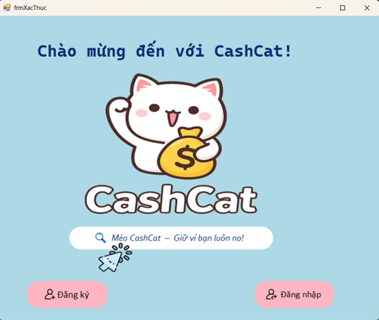

* **Đăng nhập & Đăng ký:**
    * Kiểm tra tính hợp lệ (Validation) của Email, SĐT và tránh trùng lặp tên đăng nhập.
    * Tính năng "Hiện mật khẩu" hỗ trợ thao tác chính xác.

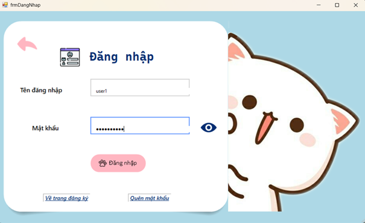
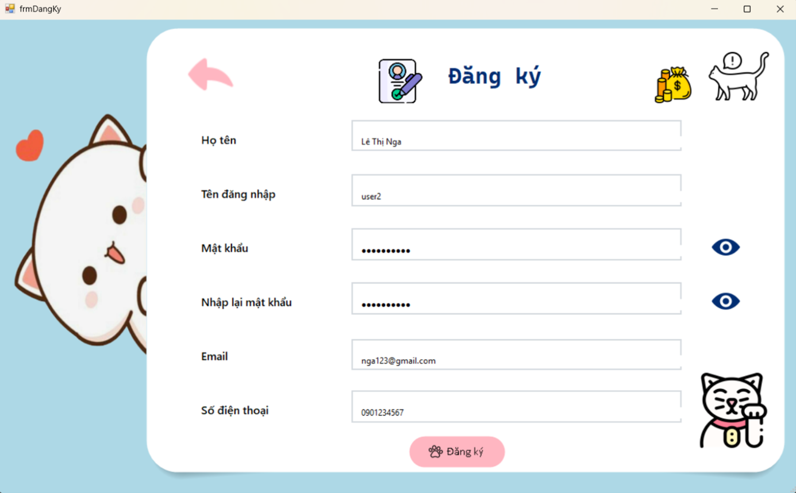

* **Khôi phục mật khẩu (OTP Email) - Điểm nổi bật:**
    * Tích hợp giao thức **SMTP** để xử lý quy trình quên mật khẩu.
    * Quy trình 3 bước: Nhập Email -> Nhập OTP xác thực -> Đặt lại mật khẩu mới.

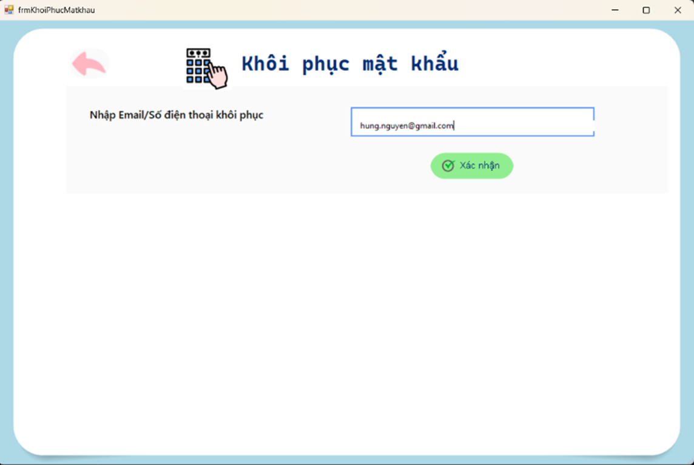
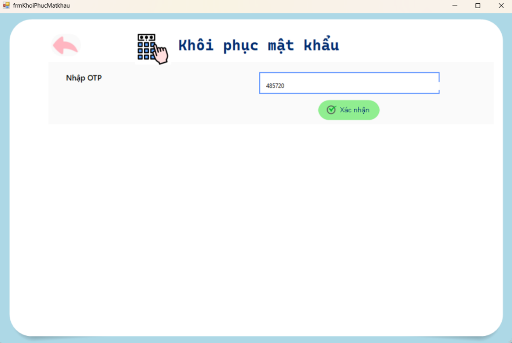
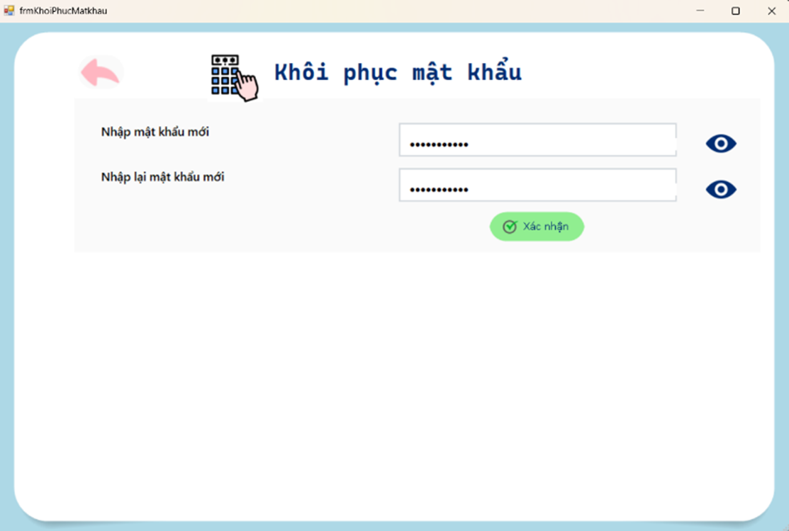

* **Quản lý hồ sơ:**
    * **Thông tin cá nhân:** Xem và cập nhật hồ sơ người dùng.
    * **Đổi mật khẩu:** Yêu cầu xác thực mật khẩu cũ trước khi cập nhật mới.
    * **Xóa tài khoản:** Tính năng an toàn với cảnh báo xác nhận trước khi xóa vĩnh viễn dữ liệu khỏi hệ thống.

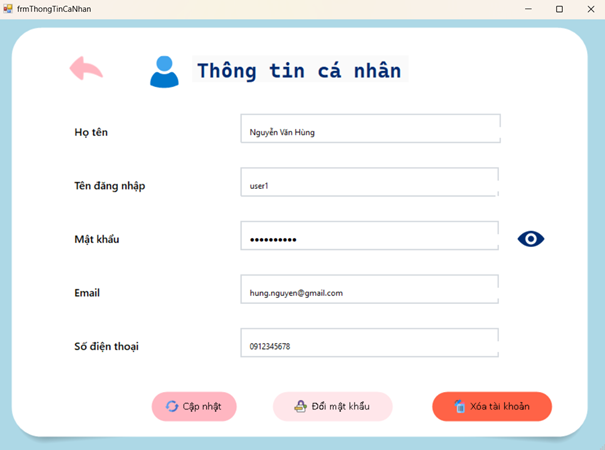
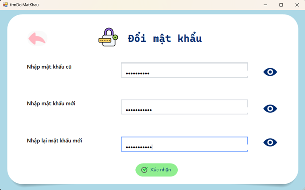

### 2. Dashboard & Điều hướng
Đóng vai trò là trung tâm điều khiển sau khi đăng nhập thành công.
* **Tổng quan tài chính:** Hiển thị nhanh số dư hiện tại, Tổng Thu và Tổng Chi trong tháng ngay trên trang chủ.
* **Thanh điều hướng:** Truy cập nhanh đến các module cốt lõi.

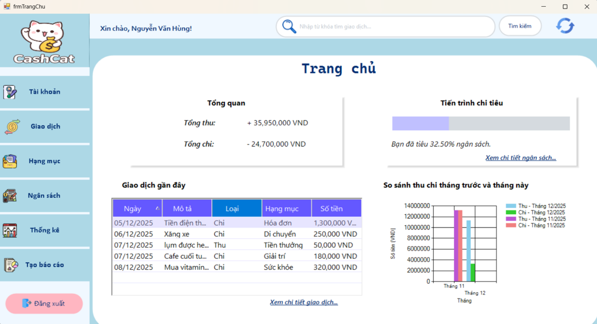

### 3. Phân hệ Quản lý Giao dịch
Chức năng cốt lõi của ứng dụng.
* **Danh sách Giao dịch:** Hiển thị trực quan trên bảng dữ liệu (DataGridView).
    * **Bộ lọc thông minh:** Lọc theo Tuần này, Tháng này, hoặc Tất cả lịch sử.
    * Tự động tính toán tổng tiền Thu/Chi tương ứng với kết quả lọc.
* **Thêm/Sửa Giao dịch:** Form nhập liệu chi tiết với validation số tiền và ngày tháng.
* **Khôi phục dữ liệu:** Tự động sao lưu dữ liệu theo thời gian và cho phép tải lại dữ liệu từ **Cloud Server (Firebase)** về máy client.

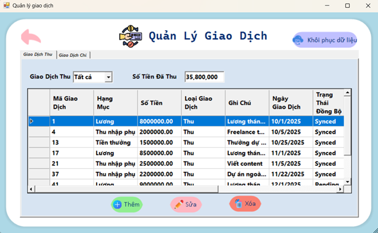
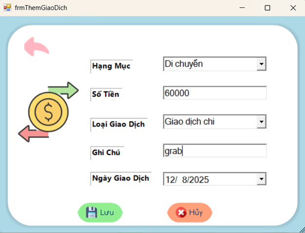

### 4. Phân hệ Tra cứu & Tìm kiếm Nâng cao
Công cụ mạnh mẽ hỗ trợ truy vết dòng tiền.
* **Bộ lọc đa chiều:** Cho phép kết hợp nhiều điều kiện:
    * Theo từ khóa.
    * Theo khoảng thời gian.
    * Theo khoảng giá trị tiền (Min - Max).
    * Theo hạng mục cụ thể.

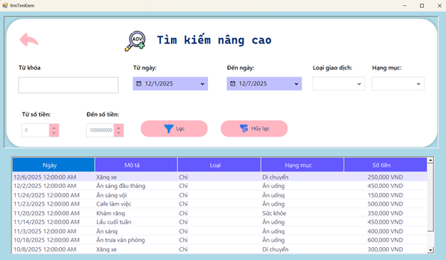

### 5. Phân hệ Quản lý Hạng mục & Ngân sách
Giúp người dùng phân loại chi tiêu khoa học.
* **Quản lý Hạng mục:** Tách biệt danh mục Thu/Chi, hỗ trợ bộ sưu tập Icon trực quan.
* **Thêm Hạng mục:** Tùy chỉnh tên và biểu tượng cho hạng mục mới.

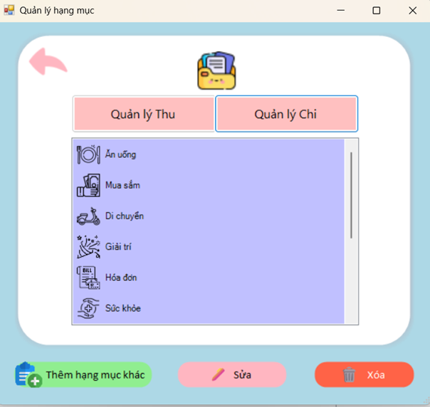
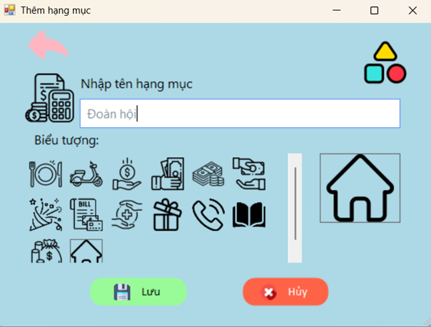

* **Thiết lập Ngân sách:**
    * Đặt hạn mức chi tiêu cho từng hạng mục theo tháng.
    * **Trực quan hóa tiến độ:** Thanh trạng thái hiển thị mức độ chi tiêu (Đã chi / Ngân sách) giúp người dùng điều chỉnh hành vi kịp thời.

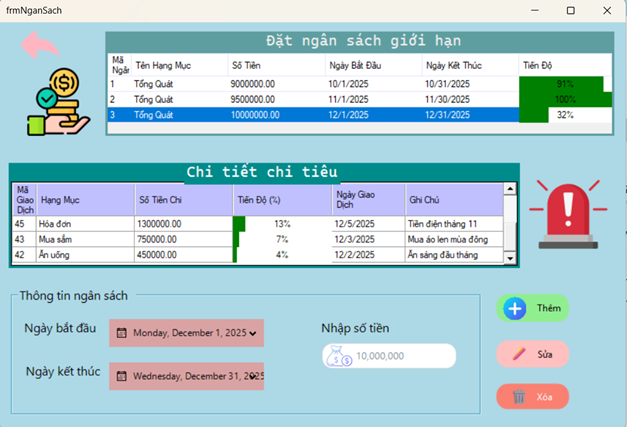

### 6. Phân hệ Báo cáo & Thống kê
Cung cấp cái nhìn tổng quan về tài chính.
* **Biểu đồ:** Sử dụng biểu đồ Cột/Tròn để hiển thị biến động số dư theo thời gian thực.

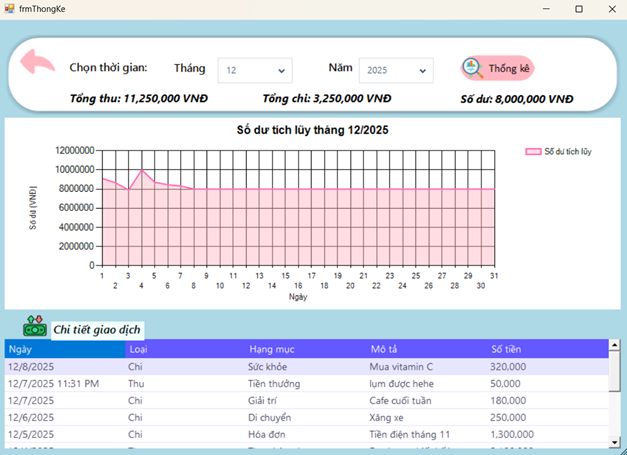

* **Xuất báo cáo (Crystal Reports):** Tích hợp công cụ báo cáo mạnh mẽ để xuất ra file (PDF, Excel,..) chuẩn mực:
    * Báo cáo Tổng hợp Thu - Chi.
    * Báo cáo Phân tích tỷ trọng chi tiêu theo Hạng mục (%).

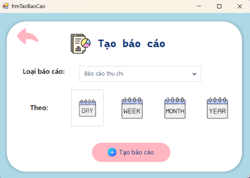

---

## Công nghệ & Thư viện (Tech Stack)

### 1. Nền tảng & Ngôn ngữ (Core)
* **Framework:** .NET Framework 4.8 (Windows Forms Application).
* **Ngôn ngữ:** C# (OOP, LINQ, Async/Await).
* **Kiến trúc:** 3-Layer Architecture (GUI - BUS - DAO) giúp tách biệt giao diện, nghiệp vụ và truy xuất dữ liệu.

### 2. Cơ sở dữ liệu & Lưu trữ (Data & Cloud)
* **SQL Server:** Lưu trữ dữ liệu chính. Sử dụng **ADO.NET** (System.Data.SqlClient) để kết nối và thao tác.
* **Firebase Realtime Database:** Sao lưu dữ liệu đám mây.
* **FireSharp / RestSharp:** Thư viện client để giao tiếp với Firebase qua REST API.

### 3. Báo cáo & Trực quan hóa (Reporting & Visualization)
* **Crystal Reports:** (CrystalDecisions.CrystalReports.Engine): Thiết kế và xuất báo cáo tài chính chuyên nghiệp.
* **Microsoft Chart Controls:** (System.Windows.Forms.DataVisualization): Vẽ biểu đồ phân tích dữ liệu trực quan.

### 4. Tiện ích & Bảo mật (Utilities & Security)
* **System.Net.Mail:** Xử lý giao thức SMTP để gửi Email OTP khôi phục mật khẩu.
* **System.Security.Cryptography:** Mã hóa mật khẩu đảm bảo an toàn dữ liệu người dùng.
* **System.Configuration:** Quản lý chuỗi kết nối và biến môi trường trong App.config.
* **Log4net:** Ghi nhật ký lỗi và theo dõi vận hành hệ thống đa cấp độ.

---

## Hướng dẫn Cài đặt (Installation)

1.  **Clone dự án:**
    ```bash
    git clone [https://github.com/DangNhu-0101/QuanLyTaiChinhCaNhanCashCat.git](https://github.com/DangNhu-0101/QuanLyTaiChinhCaNhanCashCat.git)
    ```
2.  Mở file solution (`.sln`) bằng **Visual Studio** (Khuyên dùng bản 2019 hoặc 2022).
3.  **Cấu hình Cơ sở dữ liệu:**
    * Mở file `App.config`.
    * Tìm thẻ `connectionStrings` và cập nhật chuỗi kết nối trỏ về SQL Server của bạn.
    * Chạy file Script SQL (nằm trong thư mục `Database`) để khởi tạo Bảng và Stored Procedures.
4.  Nhấn **Start** (F5) để chạy ứng dụng.

---
**Liên hệ:** dangngoctamnhu2020@gmail.com
